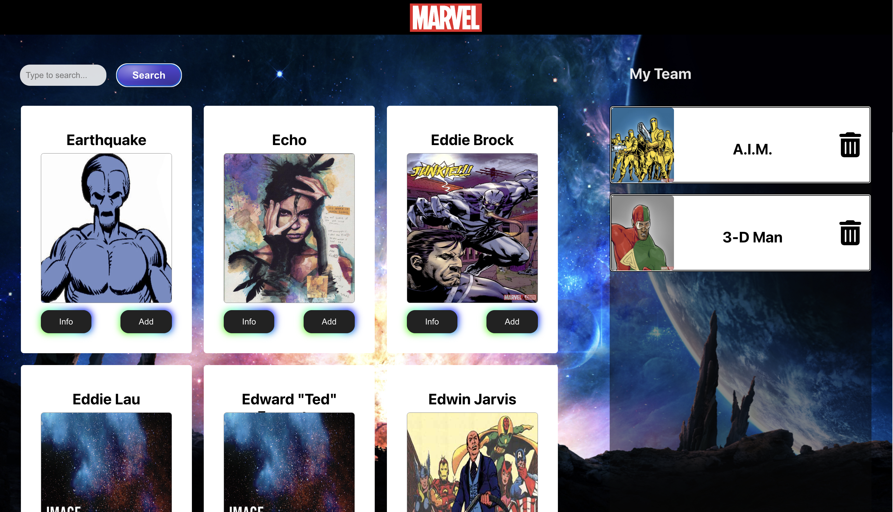

# Marvel Heroes Team

## Description

Marvel Heroes Team is a single-page web application built with React and CSS that allows users to search for Marvel characters by the first letter of their name, view more details about a chosen character, and add them to their team. The application uses the Marvel API to fetch data about the characters.

### Features

- Search for Marvel characters by the first letter of their name
- View more details about a chosen character
- Add characters to your team
- Delete characters from your team
- The same character cannot be added twice
- Chosen characters persist on page reload

### Technologies Used

- React
- React Router
- CSS
- Marvel API

### Deployment

The project is deployed and can be accessed [here](https://tijanamilenkovic-marvel-heroes-team.netlify.app).

### Usage

To use the application:

- Enter a letter in the search box to search for characters whose name begins with that letter
- Click on a character to view more details
- Click the "Add to Team" button to add the character to your team
- If the character is already on your team, the "Add to Team" button will be disabled
- Click the "Delete" button next to a character on your team to remove them
- Chosen characters will persist on page reload
- Click on the Marvel logo to return to the landing page
